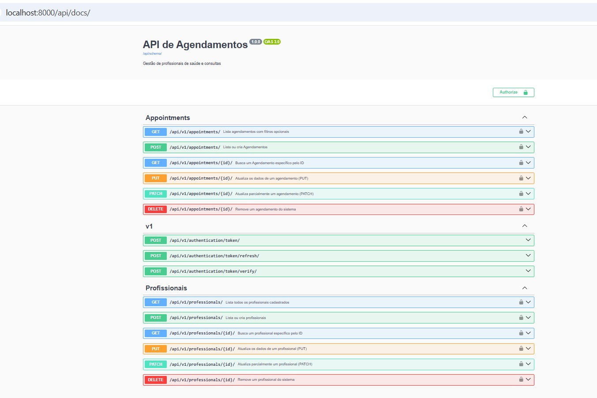
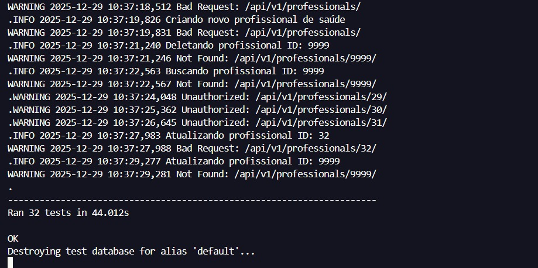

# Documentação Técnica - API

## API REST para gestão de profissionais de saúde e consultas médicas

<p>Este projeto é uma API de agendamentos desenvolvida com Django Rest Framework, focada em escalabilidade, segurança e automação via Docker. </p>

## Índice

1. Setup do Ambiente
2. Instruções para Rodar o Projeto
3. 3. Documentação da API (Swagger)
4. Testes Automatizados
5. Deploy e CI/CD
6. Justificativa técnica e estratégia e de Rollback
7. Desafios e Soluções
8. Melhorias Propostas
9. Agradecimentos
10. Como Contribuir com o projeto

### 1. Setup do ambiente

#### Pré-requisitos

- _Docker_ ([instalação](https://docs.docker.com/get-docker/)) e _Docker Compose_ ([instalação](https://docs.docker.com/compose/install/))
- _Git_ ([download](https://git-scm.com/downloads))
- _Python 3.12+_ ([download](https://www.python.org/downloads/)) - opcional para desenvolvimento local
- _Poetry_ ([instalação](https://python-poetry.org/docs/#installation)) - gerenciador de dependências
- Arquivo .env configurado ([configuração inicial](#configuração-inicial))

#### Configuração Inicial

##### Clone o repositório:

```bash
git clone --single-branch -b main git@github.com:vsantosj/api-appointments.git

#entre na pasta
cd api-appointments
```

##### Crie o arquivo . env apartir do .env.example

a. No Windows

```bash
Copy-Item dotenv_files\.env.example dotenv_files\.env
```

b. No Linux

```bash
cp dotenv_files/.env.example dotenv_files/.env
```

> **Nota:** Se preferir altere os valores das variaveis de ambiente ou utilize como está para testes.

### 2. Instruções para Rodar o Projeto

```bash
docker-compose up -d
```

> **Nota:** A primeira execução pode levar alguns minutos para baixar as imagens e construir os containers. Aguarde até que todos os serviços sejam iniciados com sucesso.

#### Crie um superusuário

```bash
docker exec -it api-appointments  poetry run python manage.py createsuperuser

# adicione usuário e senha
```

#### Demonstração criar super user

### 3. Documentação da API (Swagger)

Após a inicialização dos containers, a API estará disponível nos seguintes endereços:

- **Swagger UI:** http://localhost:8000/api/docs/
- **ReDoc:** http://localhost:8000/api/redoc/
- **Admin:** http://localhost:8000/admin/
  

### 4. Testes Automatizados

A API contém 32 testes automatizados utilizando APITestCase do Django REST Framework.

#### Cobertura de Testes

##### Professionals (16 testes)

- Autenticação: Acesso não autorizado (GET, PUT, DELETE)
- CRUD: Criar, listar, buscar, atualizar (PUT/PATCH) e deletar profissionais
- Validações: Dados inválidos, campos obrigatórios faltando
- Edge cases: Recursos inexistentes (404)

##### Agendamentos (16 testes)

- Autenticação: Controle de acesso para operações CRUD
- CRUD: Criar, listar, buscar, atualizar e deletar agendamentos
- Filtros: Busca por profissional de saúde
- Validações: Dados inválidos e campos obrigatórios
- Edge cases: Agendamentos inexistentes

#### Comando para executar os testes

```bash
docker exec -it api-appointments poetry run python manage.py test
```

##### Exemplo de saída no terminal



### 5. Deploy e CI/CD

Pipeline automatizado configurado com GitHub Actions que executa em push/PR nas branches main e develop.

#### Fluxo do Pipeline

1. **Lint**

- **O que faz:** Verifica qualidade do código com Flake8
- **Valida:** Padrões de código Python (PEP 8)
- **Ignora:** Migrações, linha longa (E501)

2. **Test**

- **O que faz:** Executa testes automatizados
- **Ambiente:** PostgreSQL 16 temporário
- **Framework:** Pytest + Django
- **Roda:** Todos os testes em `*/tests/`

3. **Build**

- **O que faz:** Valida se o projeto está pronto para deploy
- **Depende de:** Lint + Test estar OK
- **Verifica:**
  - Coleta de arquivos estáticos
  - Migrações pendentes

##### Quando executa?

- Push na `main` ou `develop`
- Pull Request para `main` ou `develop`

### 6. Justificativa técnica e estratégia e de Rollback

- **Versionamento de Imagens:** Adotei a prática de **Tags de Versão** (ex: `0.1.0`) no `docker-compose.yml` em vez de apenas utilizar `latest`. Isso garante que saibamos exatamente qual versão do código está rodando em cada momento.

#### Para garantir a continuidade do serviço em caso de falhas após um deploy, adotei a seguinte estratégia:

##### 1. Reversão de Código (Docker Rollback)

Como as imagens são versionadas com tags específicas:
a. Caso a versão atual (ex: `0.1.0`) apresente erro crítico, alteramos o campo `image:` no arquivo `docker-compose.yml` para a versão estável anterior (ex: `0.1.0`).

##### 2. Executamos o comando:

    docker-compose up -d

O Docker substituirá o container defeituoso pela versão anterior em questão de segundos.

##### 3. Backup automático do banco antes de cada deploy + tags Git sincronizadas com versões Docker.

### 7. Desafios e Soluções

#### Portabilidade do Ambiente Docker

**Problema**: Incompatibilidades ao executar containers em diferentes arquiteturas (Windows vs Linux/WSL).

**Solução:** Refinei o `Dockerfile` para usar uma imagem base mais leve e estável (`python:3.11-slim`) e garanti que todos os caminhos de volumes fossem relativos, eliminando dependências de caminhos absolutos do sistema hospedeiro.

### 8. Melhorias Propostas

- **Deploy na AWS**: Realizar o deploy da infraestrutura em uma instância EC2, utilizando o docker-compose.prod.yml e configurando o Nginx como Proxy Reverso.
- **RDS PostgreSQL**: Banco gerenciado com backups automáticos e Multi-AZ
- **Cache com Redis**: Integrar o Redis para cachear consultas frequentes, como a listagem de profissionais de saúde, melhorando o tempo de resposta da API.

### 9. Agradecimentos

Meu sincero agradecimento à Lacrei Saúde pela oportunidade de aprendizado e desenvolvimento. Este projeto foi fundamental para consolidar meus conhecimentos em infraestrutura moderna e automação. É uma honra poder apoiar tecnicamente uma ONG que realiza um trabalho tão vital para a comunidade.

🏳️‍🌈 Conheça o projeto: https://lacreisaude.com.br/

### 10. 🤝 Como Contribuir com o projeto

Quer contribuir com a api de agendamentos? Toda ajuda é bem-vinda! Aqui estão algumas formas de colaborar:

Para mais detalhes sobre como contribuir, consulte o arquivo [CONTRIBUTING.md](.github/CONTRIBUTING.md).

Desenvolvido por Viviane Santos
